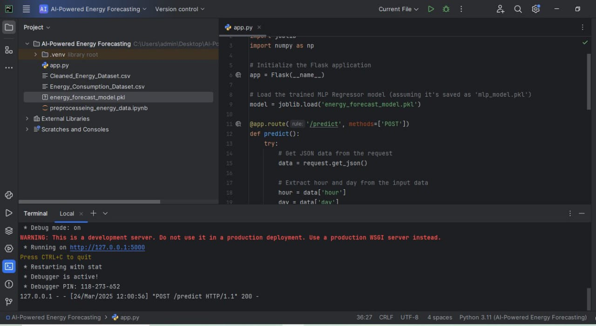
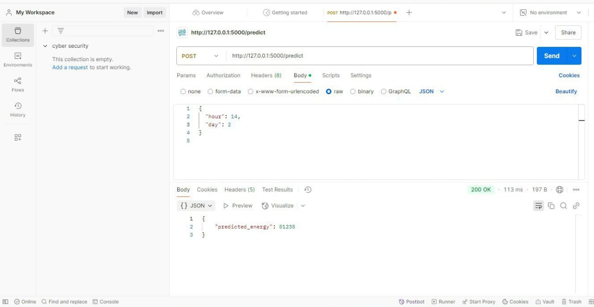

## AI-Powered Energy Consumption Forecasting 

## Overview
This project utilizes AI to predict energy consumption based on input parameters such as time (hour, day, etc.). It is built using machine learning and deployed via a Flask API to allow real-time forecasting.

## Features
1) Predicts energy consumption based on historical data.
2) Uses a trained MLP (Multi-Layer Perceptron) Regressor model.
3) Flask-based REST API for seamless integration.
4) Accepts input in JSON format and returns predictions in real-time.

## Installation 

a) Using Google Colab:
1) Open Google Colab.
2) Upload the project files to your Google Drive.
3) Open the ``.ipynb`` notebook and run the cells.

b) Using PyCharm:
1) Clone this repository or download the ZIP file.
2) Open the project in PyCharm.
3) Create a virtual environment and install dependencies using:
   ```bash
   pip install -r requirements.txt
   ```
## Usage 
1) Preprocess the data using ``preprocessing_energ_data.ipynb``.
2) Train the model using ``app.py``.
3) Evaluate and analyze the threat detection results.

## Project_Images  

### Flask Server Running  
  

### Testing with Postman  
  

## Folder Structure 
```
 AI-Powered-Energy-Consumption-Forecasting-Project/
│── App/
│   ├── app.py
│── Data/
│   ├── Energy_Consumption_Dataset.csv
│   ├── Cleaned_Energy_Dataset.csv
│── Model/
│   ├── energy_forecast_model.pkl
│── Project_Images/
│   ├── API_running_in_Flask.jpg
│   ├── API_tested_in_Postman.jpg
│── .gitignore
│── README.md
│── preprocesseing_energy_data.ipynb
```

## Contributors 
Developed by: Rahul Bhoyar

## Copyright Notice 
This project is for portfolio purposes only. Unauthorized use, modification, or distribution is not allowed.
